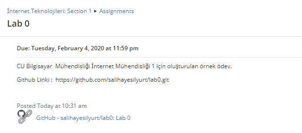
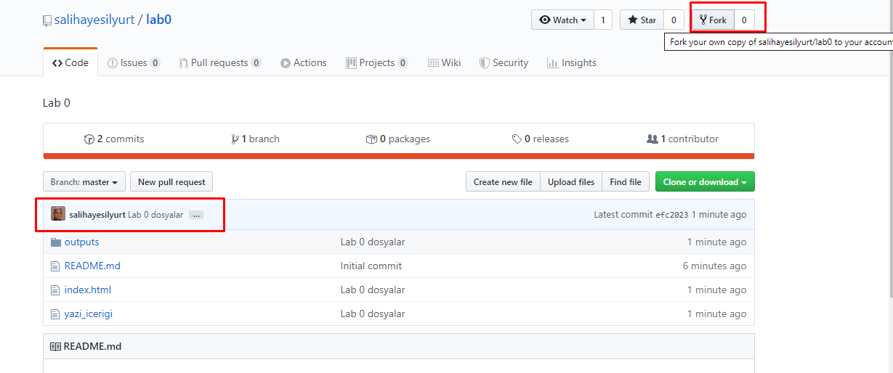
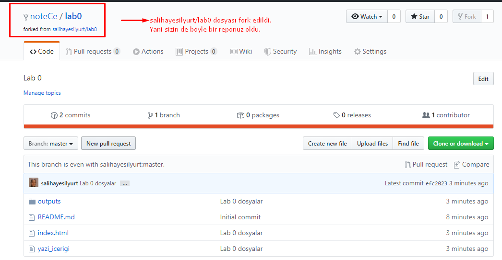
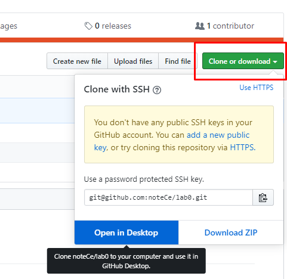
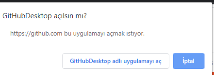
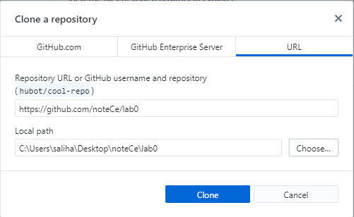
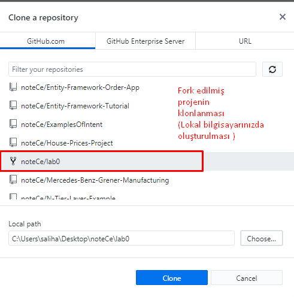
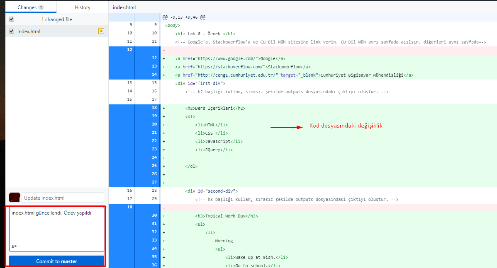
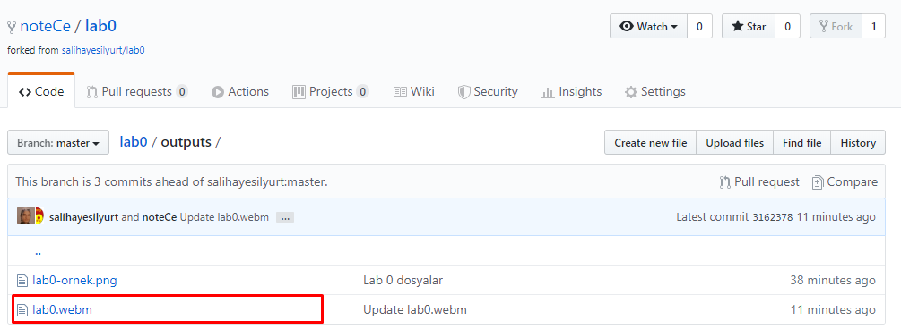
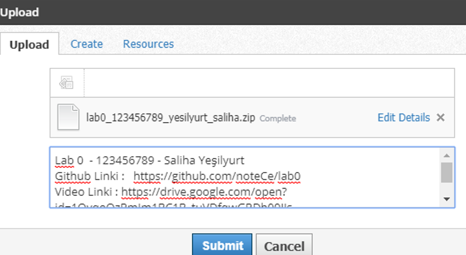

# Ödevinizi Github ve Schoology Üzerinden Gönderme

Ödevlerinizi [Github](https://github.com/) kullanarak  [Schoology](https://www.schoology.com/) üzerinden göndereceksiniz.

Her laboratuvar veya ödev teslim etmeniz gerektiğinde uygulayacağınız adımlar aşağıdadır.

1. Her ödev / laboratuvar için size bir GitHub reposu sunacağız. 

Gördüğünüz gibi bu ödev için : 
[https://github.com/salihayesilyurt/lab0.git](https://github.com/salihayesilyurt/lab0.git)


 

 
2. Çevrimiçi repoya gidin ve `Fork` butonuna tıklayın.

Fork ile ilgili kaynaklar :

[Github Help | Fork a repo](https://help.github.com/en/github/getting-started-with-github/fork-a-repo)

[Medium | Github ile Fork ve Pull Request](https://medium.com/@noteCe/github-ile-fork-ve-pull-request-be6077342834)


3. Fork ettikten sonra, projenin bir kopyasıyla Github hesabınıza yönlendirileceksiniz.



4. Repoda olduğunuzdan emin olduktan sonra `Clone or download` butonuna tıklayın ve repo'nuzun URL'sini kopyalayın.

5. Terminali açın ve ödevlerinizi ve/veya laboratuvar notlarınızı almak istediğiniz dizine geçin. Bu dizine geçtikten sonra reponuzu aşağıdaki komutla klonlayın.

`git clone <the url you copied>`

(**NOT** : Bu işlemi yapabilmek için bilgisayarınızda [Git](https://git-scm.com/downloads) yüklü olmalıdır. [Github Desktop](https://desktop.github.com/) ya da [Source Tree](https://www.sourcetreeapp.com/) gibi yardımcı araçları da kullanabilirsiniz. )

[Github Help | Cloning a repository](https://help.github.com/en/github/creating-cloning-and-archiving-repositories/cloning-a-repository)

[Medium | GitHub ile açık kaynak projelere katkıda bulunmak](https://medium.com/@cengizhanc/github-ile-a%C3%A7%C4%B1k-kaynak-projelere-katk%C4%B1da-bulunmak-8a0d79090546)

[Youtube | Sıfırdan Git Dersleri - 11 - GitHub - GitLab - BitBucket Kullanımı](https://www.youtube.com/watch?v=owimnkQ5Ebk)

**Github Desktop uygulaması ile projenizi klone etmek isterseniz:**

Uygulamaya hesabınızla giriş yapın. 









6. Yukarıdaki komut ya da işlemler ile bilgisayarınızda bir klasör oluşacak. Kodlama yapmak için kullandığınız editör yardımıyla sizden istenen ödevi gerçekleştiriniz ve Github&#39;a değişikliklerinizi gönderiniz.(`Push`)

 

7. Ödevinizin tamamlanmış halinin ekran görüntülerini `video`sunu, `gif`ini repoda yer alan outputs dosyasına ekleyiniz.

 


Tam sayfa ekran görüntüsü için kullanabileceğiz Chrome eklentisi :  [Chrome Web Mağazası | Easy Screen Capture - save &amp; send screenshots](https://chrome.google.com/webstore/detail/easy-screen-capture-save/ejkbkgbliokmbblkklofdehalgbplkfg)

Ekran videosu almak için Chrome eklentisi : [Chrome Web Mağazası | Screen Recorder](https://chrome.google.com/webstore/detail/screen-recorder/hniebljpgcogalllopnjokppmgbhaden).

Bu aracı kullanacaksanız **Uygulama Penceresi** modunda çalıştırın. Chrome Sekmesi modunda çalıştırdığınız zaman başka sekmeye geçtiğinde görünmüyor.

Farklı araçları da kullanabilirsiniz.

8. Ödevinizi tamamladığınızdan emin olduğunuzda, gönderim tarihine kadar, `Schoology’de`  yer alan  `Submission` kısmından ödevinizi  `zip` olarak sisteme yükleyiniz.

`labNo_ogrenciNo_soyad_ad.zip`

***Gönderim formatı da aşağıdaki şekilde olmalıdır. Gönderim kısmında yer alan metin kısmı aşağıdaki şekilde doldurulmalıdır. Bu formata uymayan ödevler kabul edilmeyecektir.***

```
Lab No  - Öğrenci Numarası - Ad Soyad
Github Linki :   https://github.com/noteCe/lab0
Video Linki : https://drive.google.com/open?id=1OvqoQzRmIm1BC1B_tuVDfqwGRDh09JIs
```
(NOT :Videonuzu Drive hesabı linki olarak ya da Youtube linki olarak paylaşabilirsiniz.)



9. Ayrıca videonuzu `gif`e çevirip `README.md` dosyasına aşağıdaki gibi eklemeniz yararınıza olacaktır.

``

`Gif`e çevirme aracı : [https://convertio.co/tr/mp4-gif/](https://convertio.co/tr/mp4-gif/)  (örnektir, istediğinizi kullanabilirsiniz)
